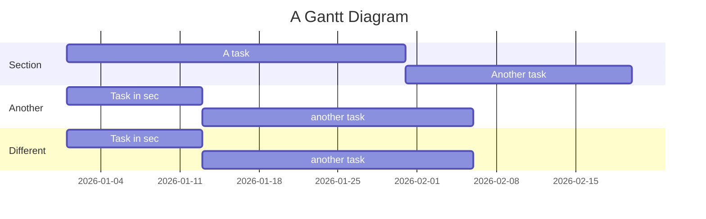

### Mermaid in markdown is so cool
> VSCode now supports mermaid charts in preview *natively*, without installing anything

Another one:

Mermaid is cool, but of course has some **learning curve**

